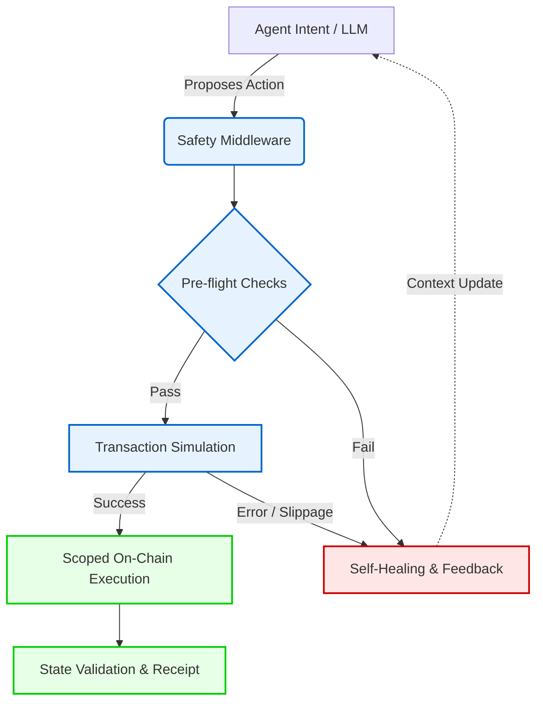

# Safe On-Chain Solana Agent Skill

**Production-grade safety middleware for autonomous AI agents on Solana.**

[](https://opensource.org/licenses/MIT)
[](https://github.com/solanabr/solana-ai-kit)
[]()

---

## 🛑 The Problem: Agentic Trust on Solana

As AI agents transition from read-only observers to active on-chain participants, the risks increase dramatically. Standard tooling often leads to hallucinated transaction parameters, incorrect slippage causing MEV attacks, drained wallets, or stalled workflows due to transient RPC errors and expired blockhashes.

An agent cannot operate truly autonomously if a human must constantly monitor execution, manually adjust parameters, or intervene after every failure.

## 🛡️ The Solution: Simulation-First Safety Middleware

The **Safe On-Chain Solana Agent Skill** provides a rigorous safety layer for the [Solana AI Kit](https://github.com/solanabr/solana-ai-kit). It treats every agent-proposed action as untrusted until verified through pre-flight checks and mainnet simulation.

By combining **scoped permissions**, **intelligent error recovery**, and **self-healing patterns**, this skill enables agents to execute reliably and autonomously — even under volatile conditions.

---

## ✨ Key Features

- **Simulation-First Execution** — Every transaction is simulated against live mainnet state before signing. This validates exact balances, slippage, compute units, and account states.
- **Scoped Permissions & Wallet Hygiene** — Supports session keys and granular, time-bound allowances instead of exposing full private keys.
- **Intelligent Error Parsing + Autonomous Retry** — Translates raw Solana program errors into meaningful feedback. Automatically recovers from transient RPC issues, blockhash expirations, and minor slippage failures.
- **Pre-Flight Validation** — Checks token accounts, rent exemptions, fee lamports, and required state before any on-chain action.
- **Progressive / Token-Efficient Loading** — Only relevant knowledge and schemas are loaded into context when needed, reducing token usage and hallucination risk.
- **Deep Composability** — Works as a safety wrapper around existing tools (Jupiter, Meteora, etc.) without requiring changes to the underlying skills.

---

## 🏗️ Architecture Overview

The skill acts as an intelligent safety layer between the agent's reasoning and the Solana network.



## 📦 Installation

### Add to Solana AI Kit (Recommended)

Clone the skill and add it to your project following the standard pattern used by other skills in the kit:

```bash
git clone https://github.com/Cryptojigi/safe-onchain-agent-skill.git
cd safe-onchain-agent-skill

# Run the installer (follow prompts)
./install.sh
```

Or manually add it as a git submodule / skill in your `.claude/skills/` directory for progressive loading.

### Source / Development

```bash
git clone https://github.com/Cryptojigi/safe-onchain-agent-skill.git
cd safe-onchain-agent-skill
```

## 🚀 Usage Examples

### 1. Safer Jupiter Swap (Prompt Example)

When the skill is loaded, Claude will automatically:
- Simulate the swap before suggesting any transaction
- Validate slippage against current market conditions
- Suggest corrected parameters or retry logic if simulation fails
- Provide clear reasoning for any adjustments

**Example prompt you can use:**
> “Perform a Jupiter swap of 25 USDC to SOL with 0.5% slippage. Use safe execution.”

Claude will now simulate first, check for realistic slippage, and only then provide the final transaction instructions.

### 2. Autonomous Position Monitoring with Self-Healing

The skill enables agents to run monitoring loops that recover gracefully from common failures (expired blockhash, RPC issues, minor price movements). Claude can now suggest safe rebalancing logic with built-in simulation and error recovery patterns.

### 3. Progressive Loading in the Solana AI Kit

The skill is designed for efficient context usage. Safety modules (simulation rules, error maps, permission patterns) are loaded only when the conversation involves on-chain actions.

## 🤝 Contributing

Contributions that improve on-chain agent safety are welcome.

1. Fork the repository
2. Create a feature branch
3. Make your changes
4. Open a Pull Request

Please keep changes focused, well-documented, and aligned with production-grade standards.

---

**Safe On-Chain Solana Agent Skill** is built to help the Solana ecosystem move toward trustworthy autonomous agents.

*MIT License © 2026*
